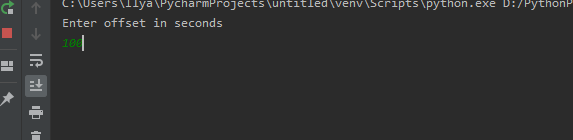
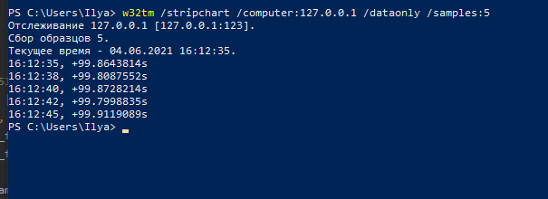

# SNTP
Sntp сревер, врет на заданное количество секунд.  
Для запуска необходимо `python sntp_server.py`  
И ввести необходимое количество секунд

Проверка сервера командой `w32tm /stripchart /computer:127.0.0.1 /dataonly /samples:5`  

